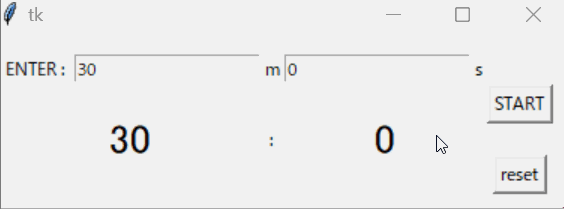

# BucksTimer

カウントダウンタイマー。
終了時間を迎えた時 ¥ellow BucksのGIOFTがアラーム音として流れる。


画像¥ellow Bucks(左)、
[GIOFT](https://www.youtube.com/watch?v=gdJs6B4Opp4)を聞いてみる。

# Description

普段の生活の中でタイマーを使用する場面が多い(カップラーメンを待つ時間、ある課題・問題に取り組んでいて制限時間を決めたいときなど。)。
これまではスマートフォンやキッチンタイマーで時間を指定していたが、どれも終了時の音楽がイケていない、
ダサいので、私の好きなラッパーの音楽を終了音に設定したカウントダウンタイマーを作った。

# DEMO  




# Requirement
* Windows10 Home
* conda == 22.9.0
* conda-build == 3.22.0
* python == 3.9.13
* playsound==1.3.0

# Installation
[Anaconda](https://www.anaconda.com/products/distribution)のサイトのダウンロードページからWindows用のPython3.9 64bit Graphical Installerをダウンロードする(Anacondaをインストール完了することでpythonの利用可能)。


```bash
pip install playsound
```

# Usage

```bash
git clone https://github.com/TIMER/~

python timerGUI.py 
```

# Note

初期設定は30分。

1時間などの設定は分単位でしか設定できない(例：1hなら60m)。

秒だけ設定する場合は分に0を入れないと実行できない(例：0分10秒)。

カウントダウン終了時の音楽の停止ボタンは無い。

# Author

* 仲座空良
* 西日本工業大学　工学部　総合システム工学科　武村研究室所属
* s202065@nishitech.ac.jp

# License

"BucksTimer" is under [MIT license](https://en.wikipedia.org/wiki/MIT_License).
